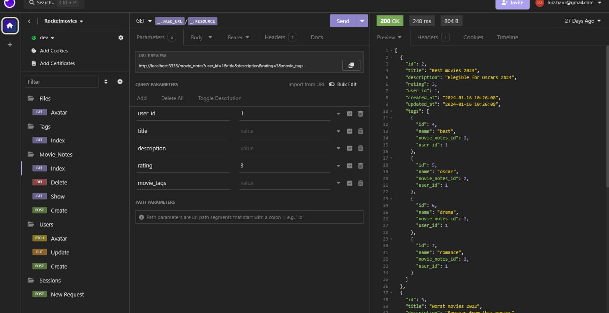

<h1 align="center">
    
    Rocketmovies API
</h1>

<p align="center">
  

  

  

  <a href="https://github.com/afsilvaluiz/rocketMovies-api/commits/master">
    
  </a>

  

   <a href="https://github.com/afsilvaluiz/rocketMovies-api/stargazers">
    
  </a>
</p>

<br>

</img>

<h4 align="center">
	🚀 Application completed 🚀
</h4>

<p align="center">
 <a href="#-about">About</a> |
 <a href="#-deploy">Deploy</a> |
 <a href="#-how-it-works">How It Works</a> |
 <a href="#-routes">Routes</a> |
 <a href="#-technologies">Technologies</a> |
 <a href="#-author">Author</a> |
 <a href="#-license">License</a>
</p>

<br>

## 💻 About

This repository works in conjunction with the corresponding frontend.

This is the backend repository for RocketMovies, a web application that allows users to record and describe movies they have watched, including titles, descriptions, ratings, and tags.

It also offers profile editing functions, such as changing avatars, names, email addresses, and passwords.

Please note that this project is part of Rocketseat's Explorer course.

<br>

## 🔗 Deploy

To access the application's website deployment, click on the following link: [Link](https://minerocketmovies.netlify.app/)

> Note: the application may take a while to start running after a while, due to the back-end running through the free plan on the hosting platform.

<br>

## 🧰 How it works

This project contains a Frontend (ReactJS) and Backend (NodeJS) part, however, this repository is only the Backend part,
to access the Frontend repository go to the following <a href="https://github.com/afsilvaluiz/rocketMovies">Link</a>

#### ⏳ Running the web application (Backend)

```bash
# Clone this repository
$ git clone git@github.com:afsilvaluiz/rocketMovies-api.git

# Go to the Backend application folder
$ cd rocketMovies-api

# Install the dependencies
$ npm install

# Run the migrations
$ npm run migrate:dev

# Run the application in development mode
$ npm run dev

# Run tests (if desired)
$ npm test

# The application will be opened on a port specified in the run terminal
```
<br>

## 🔀 Routes
<br>

</img>

> Note: All parameters sent and received in the request and response body are in `JSON` format."

<br>

## 🛠 Technologies

The following tools were used in the construction of the project:

### Server: `NodeJS`
`Express` | `Express-async-error` | `SQLite` | `Cors` | `Dotenv` <br></br>
`BcryptJS` | `JWT` | `Multer` | `PM2` | `Jest`

> For more details of the application's general dependencies, see the file [package.json](./package.json)

<br>

## 🧑🏻‍💻 Author

 


## 📝 License

This project is under the MIT license. See the [LICENSE](./LICENSE) file for more information

Made with 🎓 by Luiz Silva 🧑🏻‍💻

